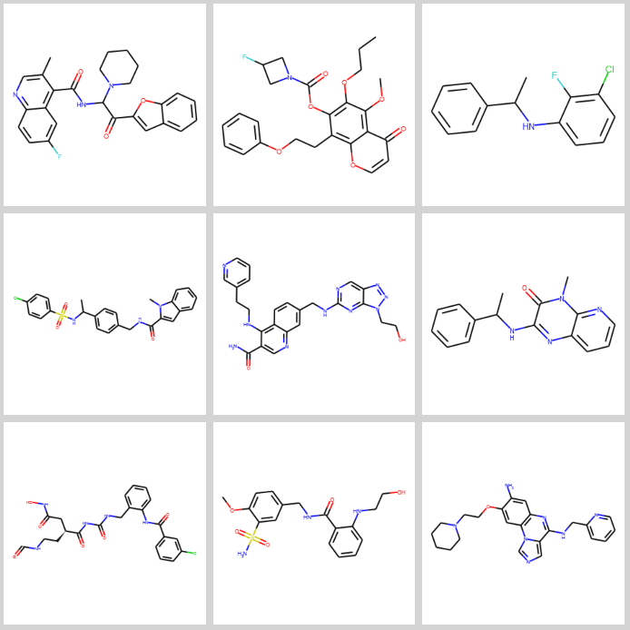

# EMolCombiner
 A fragment-based molecule generation tool for drug discovery

EMolCombiner offers a fast way to generate molecules with more control than other similar tools. Written in Python, the code is easy to modify for your purposes, yet fast, due to RDKITs' C++ backend.

## Getting Started

These instructions will get you a copy of the project up and running on your local machine for development and testing purposes. See deployment for notes on how to deploy the project on a live system.

### Prerequisites

Only dependancies are numpy, rdkit and networkx, best installed via:

`pip install {numpy, rdkit, networkx}`


### Usage

```
usage: build_mols.py [-h] --input_directory INPUT_DIRECTORY
                     [--output_directory OUTPUT_DIRECTORY]
                     [--num_mols NUM_MOLS] [--draw]

Probabilistically generate new molecules based off fragments.

optional arguments:
  -h, --help            show this help message and exit
  --input_directory INPUT_DIRECTORY
                        emolfrag output dir
  --output_directory OUTPUT_DIRECTORY
                        emolcombiner output dir
  --num_mols NUM_MOLS   number of mols to generated
  --draw                whether to draw output mols
```

Only required arg is the EMolFrag output directory; everything else has reasonable defaults. 

### Example outputs:



## License

This project is licensed under the MIT License - see the [LICENSE.md](LICENSE.md) file for details
